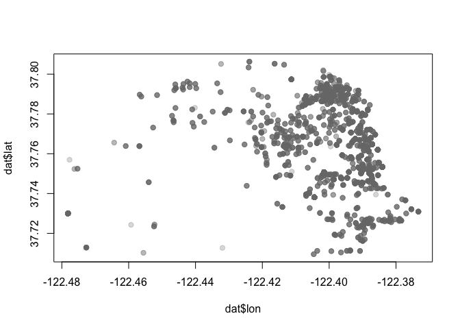
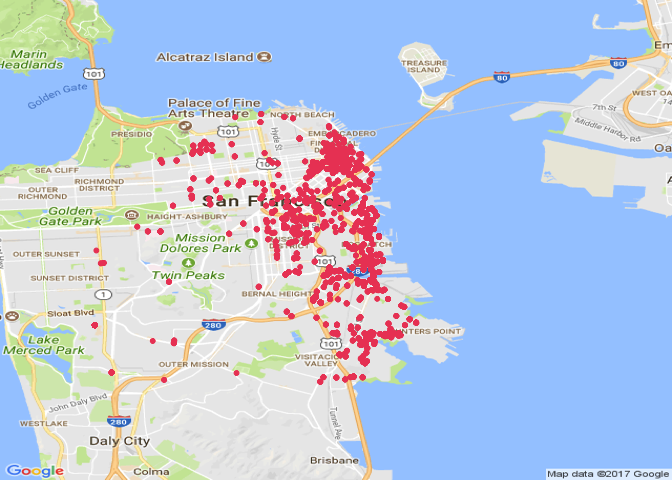
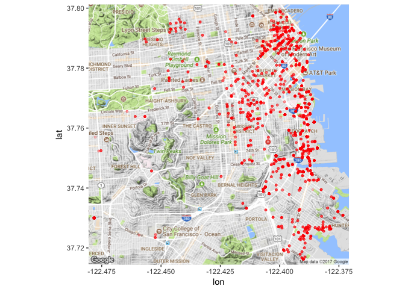

Lab 11: Regular Expressions
================
Gaston Sanchez

> ### Learning Objectives
>
> -   Work with the package `"stringr"`
> -   String manipulation
> -   More regular expressions
> -   A bit of data cleaning
> -   Making some maps

------------------------------------------------------------------------

Motivation
----------

So far we've been working with data sets that have been already cleaned, and can be imported in R ready to be analyzed.

Today we are going to start dealing with "messy" datasets. Most real life data sets require a pre-processing phase, and most of the time in any data analysis project will be spent on getting the data in the right shape. So it is extremely important that you gain skills to help you clean raw data.

### Mobile Food Schedule Data

The data set is on the github repo: <https://raw.githubusercontent.com/ucb-stat133/stat133-fall-2017/master/data/mobile-food-sf.csv>

The original source comes from the SF Open Data website: <https://data.sfgov.org/Economy-and-Community/Mobile-Food-Schedule/jjew-r69b>

Download a copy of the file to your working directory:

``` r
github <- "https://raw.githubusercontent.com/ucb-stat133/stat133-fall-2017/master/"
datafile <- "data/mobile-food-sf.csv"
download.file(paste0(github, datafile), destfile = "mobile-food-sf.csv")
```

Once you've downloaded the data file, you can read it in R:

``` r
dat <- read.csv('mobile-food-sf.csv', stringsAsFactors = FALSE)
```

The variables are:

-   `DayOfWeekStr`
-   `starttime`
-   `endtime`
-   `PermitLocation`
-   `optionaltext`
-   `ColdTruck`
-   `Applicant`
-   `Location`

### Package `"stringr"`

R has a set of built-in functions for manipulating strings. But there is also the package `"stringr"` that provides more functionality and a more user friendly syntax.

``` r
# install.packages("stringr")
library(stringr)
```

Changing Times
--------------

Let's begin processing the values in column `starttime`. The goal is to obtain new times in 24 hr format. For example, a starting time of `10AM` will be transformed to `10:00`. Likewise, a starting time of `1PM` will be transformed to `13:00`.

We are going to be manipulating character strings. Hence, I recommend to start working on a small subset of values. Figure out how to get the answers working on this subset, and then generalize to the entire data set.

Consider the first starting time that has a value of `10AM`. To get a better feeling of string manipulation, let's create a toy string with this value:

``` r
# toy string
time1 <- '10AM'
```

### Function `str_sub()`

To get the time and period values, you can use `str_sub()`:

``` r
# hour
str_sub(time1, start = 1, end = 2)
```

    ## [1] "10"

``` r
# period
str_sub(time1, start = 3, end = 4)
```

    ## [1] "AM"

**Your turn**: What about times where the hour has just one digit? For example: `9AM`, or `8AM`? Create the following vector `times` and try to subset the hour and the periods with `str_sub()`

``` r
times <- c('12PM', '10AM', '9AM', '8AM')

# subset time


# subset period


#
```

The nice thing about `str_sub()` is that it allows you to specify negative values for the `start` and `end` positions. Run the command below and see what happens:

``` r
# period
str_sub(times, start = -2)
```

### Function `str_replace()`

The tricky part with the vector `times` is the extraction of the hour. One solution is to "remove" the characters `AM` or `PM` from each time. You can do this with the substitution function `str_replace()`:

``` r
str_replace(times, pattern = 'AM|PM', replacement = '')
```

    ## [1] "12" "10" "9"  "8"

### Your Turn

So far you've managed to get the hour value and the period. Notice that you still need to convert the hours as numeric vectors:

``` r
hours <- as.numeric(str_replace(times, pattern = 'AM|PM', replacement = ''))
periods <- str_sub(times, start = -2)
```

-   Transform the hours into 24 hr values. Write R code to create a vector `start24` that contains the hour in 24hr scale.

``` r
# your vector start24
```

-   Add two columns `start` and `end` to the data frame `dat`, containing the starting and ending hour respectively (columns must be `"numeric"`).

``` r
# add 'start' hours


# add 'end' hours
```

-   With the starting and ending hours, calculate the duration, and add one more column `duration` to the data frame `dat`:

``` r
# add 'duration'
```

------------------------------------------------------------------------

Latitude and Longitude Coordinates
----------------------------------

Another interesting column in the data is `Location`. If you look at this column, you will see values like the following string `loc1`

``` r
loc1 <- "(37.7651967350509,-122.416451692902)"
```

The goal is to split `Location` into latitude and longitude. The first value corresponds to latitude, while the second value corresponds to longitude.

First we need to remove the parenthesis. The issue here is that the characters `(` and `)` have special meanings; recall they are metacharacters. So you need to **escape** in R them by pre-appending two backslashes: `\\(` and `\\)`

``` r
# "remove" opening parenthesis 
str_replace(loc1, pattern = '\\(', replacement = '')
```

    ## [1] "37.7651967350509,-122.416451692902)"

``` r
# "remove" closing parenthesis
str_replace(loc1, pattern = '\\)', replacement = '')
```

    ## [1] "(37.7651967350509,-122.416451692902"

You can also combine both patterns in a single call. But be careful:

``` r
str_replace(loc1, pattern = '\\(|\\)', replacement = '')
```

    ## [1] "37.7651967350509,-122.416451692902)"

`str_replace()` replaces only the first occurrence of `(` or `)`. However, the location values contain both opening and closing parentheses. To replace them all, you have to use `str_replace_all()`

``` r
str_replace_all(loc1, pattern = '\\(|\\)', replacement = '')
```

    ## [1] "37.7651967350509,-122.416451692902"

Now we need to get rid of the comma `,`. You could replace it with an empty string, but then you will end up with one long string like this:

``` r
lat_lon <- str_replace_all(loc1, pattern = '\\(|\\)', replacement = '')

str_replace(lat_lon, pattern = ',', replacement = '')
```

    ## [1] "37.7651967350509-122.416451692902"

Instead of replacing the comma, what we need to use is `str_split()`

``` r
# string split in stringr
str_split(lat_lon, pattern = ',')
```

    ## [[1]]
    ## [1] "37.7651967350509"  "-122.416451692902"

Notice that `str_split()` returns a list.

### Manipulating more location values

Let's define a vector with more location values, so we can start generalizing our code:

``` r
locs <- c(
  "(37.7651967350509,-122.416451692902)",
  "(37.7907890558203,-122.402273431333)",
  "(37.7111991003088,-122.394693339395)",
  "(37.7773000262759,-122.394812784799)",
  NA
)
```

-   create a list `lat_lon` containing the latitude and the longitude values of `locs`

Assuming that you have `lat_lon`, to retrieve the latitude and longitude values, you can use the `lapply()` function, and then specify an *anonymous* function to get the first element (for the latitude):

``` r
lat <- lapply(lat_lon, function(x) x[1])
```

### Your Turn

Create a list `lon` by using `lapply()` with an anonymous function to extract longitude value (i.e. the second element):

To convert from list to a vector, use `unlist()`

``` r
latitute <- as.numeric(unlist(lat))
longitude <- as.numeric(unlist(lon))
```

Add two more columns: `lat` and `lon` to the data frame `dat`

``` r
# your code
```

------------------------------------------------------------------------

Plotting locations on a map
---------------------------

Now that you have two vectors `latitude` and `longitude`, and the corrsponding columns `lat` and `lon` in the data frame `dat`, let's try to plot those coordinates on a map.

A naive option would be to graph the locations with `plot()`:

``` r
plot(dat$lon, dat$lat, pch = 19, col = "#77777744")
```



Althouth the previous call shows the dots with the right latitude and longitude coordinates, there's no visual cues that let us perceive the information in a *geographical* way.

Instead of displaying a *naked* `plot()`, we can use the package `"RgoogleMaps"` which is one the several packages available in R to plot maps.

``` r
# install.packages("RgoogleMaps")
library(RgoogleMaps)
```

To get a map you use the function `GetMap()` which requires a `center` and a `zoom` specifications. The `center` is a vector with the latitude and longitude coordinates. The argument `zoom` refers to the zoom level.

``` r
# coordinates for center of the map
center <- c(mean(dat$lat, na.rm = TRUE), mean(dat$lon, na.rm = TRUE))

# zoom value
zoom <- min(MaxZoom(range(dat$lat, na.rm = TRUE), 
                    range(dat$lon, na.rm = TRUE)))

# san francisco map
map1 <- GetMap(center=center, zoom=zoom, destfile = "san-francisco.png")
```

The code above downloads a static map from the Google server and saves it in the specified destination file. To make a plot you have to use `PlotOnStaticMap()`

``` r
PlotOnStaticMap(map1, dat$lat, dat$lon, col = "#ed4964", pch=20)
```



------------------------------------------------------------------------

Maps with `"ggmap"`
-------------------

Another useful package for plotting maps is `"ggmap"`. As you may guess, `"ggmap"` follows the graphing approach of `"ggplot2"`.

As usual, you need to install the package:

``` r
# remember to install ggmap
install.packages("ggmap")
library(ggmap)
```

It is possible that you run into some issues with `"ggmap"` (and `"ggplot2"`). Apparently, there are a couple of conflicting bugs in some versions of these packages. If you encounter some cryptic errors, you may switch to an older version of `"ggplot2"`

``` r
# skip this part (come back if you run into some error messages)
# (go back to a previous version of ggplot)
devtools::install_github("hadley/ggplot2@v2.2.0")
```

Here I'm assuming that the data frame `dat` already includes columns `lat` and `lon`:

``` r
# add variables 'lat' and 'lon' to the data frame
dat$lat <- latitude
dat$lon <- longitude
```

Because some rows have missing values in the geographical coordinates, we can get rid of them with `'na.omit()`:

``` r
# let's get rid of rows with missing values
dat <- na.omit(dat)
```

In order to plot a map with `ggmap()`, we need to define the region of the map via the function `make_bbox()`:

``` r
# ggmap typically asks you for a zoom level, 
# but we can try using ggmap's make_bbox function:
sbbox <- make_bbox(lon = dat$lon, lat = dat$lat, f = .1)
sbbox
```

    ##       left     bottom      right        top 
    ## -122.48867   37.69985 -122.36281   37.81595

Now that you have the object `sbbox`, the next step is to get a map with `get_map()`. This function gets a map from Google by default.

``` r
# get a 'terrain' map
sf_map <- get_map(location = sbbox, maptype = "terrain", source = "google")
```

    ## Warning: bounding box given to google - spatial extent only approximate.

    ## converting bounding box to center/zoom specification. (experimental)

    ## Source : https://maps.googleapis.com/maps/api/staticmap?center=37.757897,-122.425744&zoom=13&size=640x640&scale=2&maptype=terrain&language=en-EN

Having obtained the `sf_map` object, we can finally use `ggmap()` to plot some dots with our `lat` and `lon` coordinates:

``` r
ggmap(sf_map) + 
  geom_point(data = dat, 
             mapping = aes(x = lon, y = lat), 
             color = "red", alpha = 0.2, size = 1)
```

    ## Warning: Removed 98 rows containing missing values (geom_point).



------------------------------------------------------------------------

Let's look for specific types of food
-------------------------------------

The data table `dat` contains a column `optionaltext` describing the types of food and meals served by the food trucks. Let's take a look at the first 3 elements:

``` r
dat$optionaltext[1:3]
```

    ## [1] "Tacos, Burritos, Tortas, Quesadillas, Mexican Drinks, Aguas Frescas"   
    ## [2] "Cold Truck: sandwiches, drinks, snacks, candy, hot coffee"             
    ## [3] "Cold Truck: Pre-packaged Sandwiches, Various Beverages, Salads, Snacks"

Notice that the first element (i.e. the first food truck) prepares *Tacos, Burritos, Tortas, Quesadillas*, etc.

What if you want to identify all locations that have burritos? This is where regular expressions comes very handy. Again, always start small: select the first 10 elements of `optionaltext`

``` r
foods <- dat$optionaltext[1:10]
```

-   Use `str_detect()` (or equivalently `grep()`) to match `"Burritos"` and `"burritos"`.
-   If you use `grepl()`, you can use `ignore.case = TRUE` to match for both.
-   Try another pattern: e.g. `"tacos"`, or `"quesadillas"`
-   Now create a data frame `burritos` by subsetting (i.e. filtering) the data frame to get only those rows that match `"burritos"`
-   Use the `lat` and `lon` corrdinates in `burritos` to display a map of locations with *burritos* (see map below).
-   Experiment with other types of foods
-   Challenge: try use facetting to show a type of food per facet (e.g. one facet for burritos, another for quesadillas, another one for tacos, etc)


------------------------------------------------------------------------

Practice more Regex patterns
----------------------------

Here's a vector with some character strings:

``` r
# vector of strings
animals <- c('dog', 'cat', 'bird', 'dolphin', 'lion',
             'zebra', 'tiger', 'wolf', 'whale', 'eagle',
             'pig', 'osprey', 'kangaroo', 'koala')
```

Let's match the pattern `dog` with `grep()`

``` r
grep('dog', animals)
```

    ## [1] 1

To *extract* the matched pattern, you can use `grep()` with the argument `value = TRUE`:

``` r
grep('dog', animals, value = TRUE)
```

    ## [1] "dog"

Using `"stringr"` functions, you can use `str_detect()` to check if there is a match:

``` r
str_detect(animals, 'dog')
```

    ##  [1]  TRUE FALSE FALSE FALSE FALSE FALSE FALSE FALSE FALSE FALSE FALSE
    ## [12] FALSE FALSE FALSE

To extract the matched pattern, you use `str_extract()`:

``` r
str_extract(animals, 'dog')
```

    ##  [1] "dog" NA    NA    NA    NA    NA    NA    NA    NA    NA    NA   
    ## [12] NA    NA    NA

What if you just want to extract the matched pattern and nothing else? Then use logical subsetting:

``` r
animals[str_detect(animals, 'dog')]
```

    ## [1] "dog"

### Your turn

Use `str_extract()`, and logical subsetting with `str_detect()`, to find the names of animals with:

-   zero or more `o`
-   zero or one `o`
-   at least 1 `o`: `"dog" "dolphin" "lion" "wolf" "osprey" "kangaroo" "koala"`
-   exactly 2 `o`'s together: `"kangaroo"`
-   one `o`, but not two `o`'s together: `"dog" "dolphin" "lion"    "wolf" "osprey"  "koala"`
-   two vowels together: `"lion" "eagle" "kangaroo" "koala"`
-   two consonants together: `"bird" "dolphin"  "zebra" "wolf"     "whale" "eagle" "osprey" "kangaroo"`
-   three consonants together: `"dolphin" "osprey"`
-   three letters only: `"dog" "cat" "pig"`
-   four letters only: `"bird" "lion" "wolf"`

------------------------------------------------------------------------

File Names
----------

Here's another character vector with some file names and their extensions:

``` r
files <- c('sales1.csv', 'orders.csv', 'sales2.csv',
           'sales3.csv', 'europe.csv', 'usa.csv', 'mex.csv',
           'CA.csv', 'FL.csv', 'NY.csv', 'TX.csv',
           'sales-europe.csv', 'sales-usa.csv', 'sales-mex.csv')
```

### Your turn

-   Find the file names containing numbers
-   Find the file names containing no numbers
-   Find the file names containing lower case letters
-   Find the file names containing upper case letters
-   Find the file names containing a dash
-   Find the file names containing no dash
-   Create a vector of files by replacing the 'csv' extension into 'txt' extension
-   Separate file name from file extension

------------------------------------------------------------------------

Some Functions
--------------

Create a function `split_chars()` that splits a character string into one single character elements. The output must be a single character vector. For example, `split_chars('Go Bears!')` should return

    "G" "o" " " "B" "e" "a" "r" "s" "!"

Here's another exmaple, `split_chars('Expecto Patronum')` should return:

    "E" "x" "p" "e" "c" "t" "o" " " "P" "a" "t" "r" "o" "n" "u" "m"

Write a function `reverse_chars()` that reverses a string by characters. For instance: `reverse_chars("gattaca")` should return

    "acattag"

and `reverse_chars("Lumox Maxima")` should return

    "amixaM xomuL"
