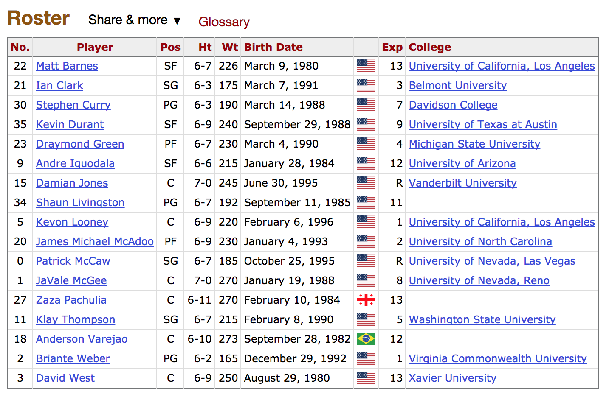
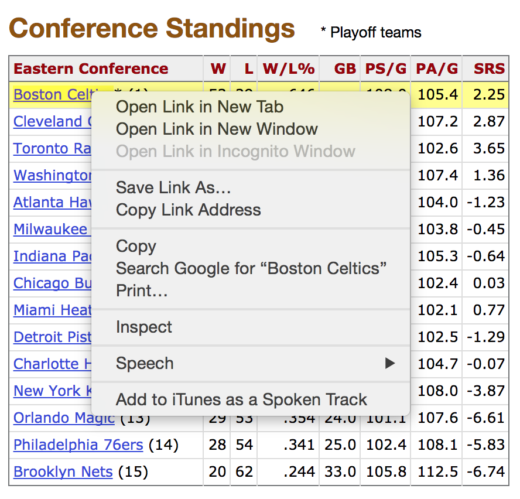
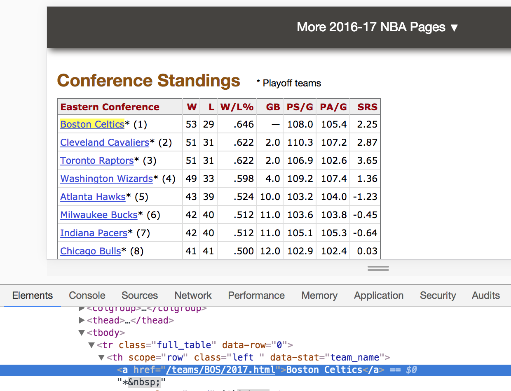

Lab 12: Getting Started with Web Scraping
================
Gaston Sanchez

> ### Learning Objectives
>
> -   Work with the package `"rvest"`
> -   Learn to extract html elements and attributes
> -   Create a simple crawler

------------------------------------------------------------------------

Required Packages
-----------------

In this lab, you will have to load the following R packages:

``` r
library(XML)
library(xml2)
library(rvest)
library(magrittr)
```

Motivation
----------

The goal of this lab is to extract the Roster Tables of all the NBA teams from the website <https://www.basketball-reference.com/>

More specifically, you will extract the rosters of the season 2016-2017. One example of such table is displayed in the image below with the Roster of Golden State Warriors (GSW):



The GSW Roster table is in the URL:

<https://www.basketball-reference.com/teams/GSW/2017.html>

You can read this table in R via the `"XML"` function `readHTMLTable()`:

``` r
# Assemble url (so it fits on screen)
basket <- "https://www.basketball-reference.com"
gsw <- "/teams/GSW/2017.html"
gsw_url <- paste0(basket, gsw)

# download HTML file to your working directory
download.file(gsw_url, 'gsw-2017.html')

# Read GSW Roster html table
gsw_roster <- readHTMLTable('gsw-2017.html')
```

If you inspect the contents of `gsw_roster` you should be able to see some content like this:

    ## $roster
    ##    No.               Player Pos   Ht  Wt         Birth Date    Exp
    ## 1   22          Matt Barnes  SF  6-7 226      March 9, 1980 us  13
    ## 2   21            Ian Clark  SG  6-3 175      March 7, 1991 us   3
    ## 3   30        Stephen Curry  PG  6-3 190     March 14, 1988 us   7
    ## 4   35         Kevin Durant  SF  6-9 240 September 29, 1988 us   9
    ## 5   23       Draymond Green  PF  6-7 230      March 4, 1990 us   4
    ## 6    9       Andre Iguodala  SF  6-6 215   January 28, 1984 us  12
    ## 7   15         Damian Jones   C  7-0 245      June 30, 1995 us   R
    ## 8   34     Shaun Livingston  PG  6-7 192 September 11, 1985 us  11
    ## 9    5         Kevon Looney   C  6-9 220   February 6, 1996 us   1
    ## 10  20 James Michael McAdoo  PF  6-9 230    January 4, 1993 us   2
    ## 11   0        Patrick McCaw  SG  6-7 185   October 25, 1995 us   R
    ## 12   1         JaVale McGee   C  7-0 270   January 19, 1988 us   8
    ## 13  27        Zaza Pachulia   C 6-11 270  February 10, 1984 ge  13
    ## 14  11        Klay Thompson  SG  6-7 215   February 8, 1990 us   5
    ## 15  18     Anderson Varejao   C 6-10 273 September 28, 1982 br  12
    ## 16   2        Briante Weber  PG  6-2 165  December 29, 1992 us   1
    ## 17   3           David West   C  6-9 250    August 29, 1980 us  13
    ##                                  College
    ## 1  University of California, Los Angeles
    ## 2                     Belmont University
    ## 3                       Davidson College
    ## 4          University of Texas at Austin
    ## 5              Michigan State University
    ## 6                  University of Arizona
    ## 7                  Vanderbilt University
    ## 8                                       
    ## 9  University of California, Los Angeles
    ## 10          University of North Carolina
    ## 11       University of Nevada, Las Vegas
    ## 12            University of Nevada, Reno
    ## 13                                      
    ## 14           Washington State University
    ## 15                                      
    ## 16      Virginia Commonwealth University
    ## 17                     Xavier University

### Roster tables

Say you are interested in obtaining the Roster table for the Boston Celtics (BOS). You could get such table by adapting the code used to get the GSW roster. The only thing you need to change is the team abbreviation from `GSW` to `BOS`:

``` r
# Assemble url (so it fits on screen)
basket <- "https://www.basketball-reference.com"
bos <- "/teams/BOS/2017.html"
bos_url <- paste0(basket, bos)

# download HTML file to your working directory
download.file(bos_url, 'bos-roster-2017.html')

# Read BOS Roster html table
bos_roster <- readHTMLTable('bos-roster-2017.html')
```

In order to get the Roster tables of all the NBA teams, you would need to repeat the same operation with the corresponding team abbreviations. But how do you get these abbreviations in a programmatic way?

2016-17 NBA Season Summary
--------------------------

To get the team abbreviations in a programmatic way, you need to find URLs of the form `"/teams/GSW/2017.html"`, `"/teams/BOS/2017.html"`, etc. These pieces of information are available in the Basketball-Reference website in several web pages.

One of those web pages is the *2016-17 NBA Season Summary* which can be accessed in the following URL:

<https://www.basketball-reference.com/leagues/NBA_2017.html>

In particular, this page contains information about the *Conference Standings* displayed in two HTML tables (see screenshot below)


We don't really care about the conference standings. What we care about is that these two HTML tables contain both: the names of the NBA teams (rendered on your browser), as well as the href attributes of the form: `"/teams/GSW/2017.html"`.

If you use Google Chrome as your web browser, you can inspect the HTML source code by right clicking on your mouse, and selecting the `Inspect` option. For instance, place the cursor over the *Boston Celtics* link, and then launch the inspector:



If you look at the HTML source, you will see the `href` attributes for each team page. In other words, these are the links to each team's web page. And this is exactly the piece of information we are looking for: the team abbreviations.



Extracting HTML elements
------------------------

So how do we extract these `href` attributes? The first step is to read the contents of the html file:

<https://www.basketball-reference.com/leagues/NBA_2017.html>

This can be done with the function `read_html()`

``` r
nba_html <- paste0(basket, "/leagues/NBA_2017.html")

xml_doc <- read_html(nba_html)
```

The object `xml_doc` is an object of class `"xml_document"`. If you are curoius about extracting all the content in a character vector, then use the function `html_text()`, chained with the pipe `%>%` operator:

``` r
xml_text <- xml_doc %>% html_text()
```

The object `xml_text` is a character vector that contains the content of the html file.

### Extracting elements `h2`

Before attempting extracting the href attributes, let's begin with something simpler. For example, extracting the value of all the HTML elements **h2** (i.e. headings of level 2). This can be done with the function `html_nodes()`, and then `html_text()`

``` r
# content of h2 nodes
xml_doc %>%
  html_nodes("h2") %>%
  html_text() 
```

    ##  [1] "Conference Standings"         " "                           
    ##  [3] "Division Standings"           " "                           
    ##  [5] "Playoff Series"               "Team Per Game Stats"         
    ##  [7] "Opponent Per Game Stats"      "Team Stats"                  
    ##  [9] "Opponent Stats"               "Team Per 100 Poss Stats"     
    ## [11] "Opponent Per 100 Poss Stats"  "Miscellaneous Stats"         
    ## [13] "Team Shooting"                "Opponent Shooting"           
    ## [15] "League Awards"                "Players of the Week & Month" 
    ## [17] "League Leaders"               "All-NBA"                     
    ## [19] "All-Defensive"                "All-Rookie"                  
    ## [21] "All-Star Game Rosters"        "More 2016-17 NBA Pages"      
    ## [23] "Full Site Menu"               "We're Social...for Statheads"
    ## [25] "FAQs, Tip & Tricks"

You can pass the name of an HTML element (i.e. a tag or node) to `html_nodes()`. In this case, we indicate that we want to locate the nodes `"h2"`. And then we call `html_text()` to *extract* the actual content in those nodes.

### Your turn

Use `html_nodes()` and `html_text()` to extract the values of nodes:

-   `"h1"`
-   `"strong"`
-   `"button"`

------------------------------------------------------------------------

What if you want to extract HTML tags or nodes that have an attribute? For instance, if you look at the source code, starting at line 356 you will see the following HTML elements for *Player Stats*:

``` html
<p class="listhead"><strong>Player Stats</strong></p>
    <ul class="">
        <li><a href="/leagues/NBA_2017_per_game.html">Per Game</a></li>
        <li><a href="/leagues/NBA_2017_totals.html">Totals</a></li>
        <li><a href="/leagues/NBA_2017_per_minute.html">Per 36 Minutes</a></li>
        <li><a href="/leagues/NBA_2017_per_poss.html">Per 100 Possessions</a></li>
        <li><a href="/leagues/NBA_2017_advanced.html">Advanced</a></li>
    </ul>
```

As you can tell, there is a `p` element (i.e. html paragraph) of class `"listhead"`. You can actually specify this type of node with the name of the html element, followed by a dot, followed by the name of the attribute:

``` r
# node with an attribute
xml_doc %>%
  html_nodes("p.listhead") %>%
  html_text()
```

    ## [1] "Player Stats"          "Other"                 "2017 Playoffs Summary"
    ## [4] "Player Stats"          "Other"                 "2017 Playoffs Summary"

In order to specify HTML elements that are embeded inside other HTML elements, you need to use *X paths*. Xpaths are expressions (similar to file paths) that allow you to indicate the specific *path* that must be taken to arrive at a given node. The previous `p.listhead` nodes can also be extracted with an Xpath expression:

``` r
xml_doc %>%
  html_nodes(xpath = '//p[@class="listhead"]') %>%
  html_text()
```

    ## [1] "Player Stats"          "Other"                 "2017 Playoffs Summary"
    ## [4] "Player Stats"          "Other"                 "2017 Playoffs Summary"

What if you want to extract the `<a>` values inside the listed items `<li>`, within the unlisted list `<ul>`?

``` r
xml_doc %>%
  html_nodes(xpath = '//ul[@class=""]/li/a') %>%
  html_text()
```

    ##  [1] "Per Game"             "Totals"               "Per 36 Minutes"      
    ##  [4] "Per 100 Possessions"  "Advanced"             "Debuts"              
    ##  [7] "Final Season"         "Team Ratings"         "Uniform Numbers"     
    ## [10] "Transactions"         "Standings"            "Schedule and Results"
    ## [13] "Leaders"              "Per Game"             "Totals"              
    ## [16] "Per 36 Minutes"       "Per 100 Possessions"  "Advanced"            
    ## [19] "Debuts"               "Final Season"         "Team Ratings"        
    ## [22] "Uniform Numbers"      "Transactions"         "Standings"           
    ## [25] "Schedule and Results" "Leaders"              "Per Game"            
    ## [28] "Totals"               "Per 36 Minutes"       "Per 100 Possessions" 
    ## [31] "Advanced"             "Debuts"               "Final Season"        
    ## [34] "Team Ratings"         "Uniform Numbers"      "Transactions"

or equivalently:

``` r
xml_doc %>%
  html_nodes(xpath = '//ul[@class=""]//a') %>%
  html_text()
```

    ##  [1] "Per Game"             "Totals"               "Per 36 Minutes"      
    ##  [4] "Per 100 Possessions"  "Advanced"             "Debuts"              
    ##  [7] "Final Season"         "Team Ratings"         "Uniform Numbers"     
    ## [10] "Transactions"         "Standings"            "Schedule and Results"
    ## [13] "Leaders"              "Per Game"             "Totals"              
    ## [16] "Per 36 Minutes"       "Per 100 Possessions"  "Advanced"            
    ## [19] "Debuts"               "Final Season"         "Team Ratings"        
    ## [22] "Uniform Numbers"      "Transactions"         "Standings"           
    ## [25] "Schedule and Results" "Leaders"              "Per Game"            
    ## [28] "Totals"               "Per 36 Minutes"       "Per 100 Possessions" 
    ## [31] "Advanced"             "Debuts"               "Final Season"        
    ## [34] "Team Ratings"         "Uniform Numbers"      "Transactions"

Extracting `href` attributes
----------------------------

Let's focus again on the first two html tables of the page <https://www.basketball-reference.com/leagues/NBA_2017.html>.

To extract the first `"table"` you can use `html_nodes()` and `extract()` as follows:

``` r
# extracting first table 
xml_table1 <- xml_doc %>%
  html_nodes("table") %>%
  extract(1)
```

Likewise, the second table can be extracted as follows

``` r
# extracting second table 
xml_table2 <- xml_doc %>%
  html_nodes("table") %>%
  extract(2)
```

Actually, both table can be extracted simultaneously:

``` r
# two html tables
xml_tables <- xml_doc %>%
  html_nodes("table") %>%
  extract(1:2)
```

Having extracted the tables we are interested in, we can select the `<a>` nodes, and then extract the values that correspond to the names of the teams:

``` r
# extract names of teams
xml_tables %>% 
  html_nodes("a") %>%
  html_text()
```

    ##  [1] "Boston Celtics"         "Cleveland Cavaliers"   
    ##  [3] "Toronto Raptors"        "Washington Wizards"    
    ##  [5] "Atlanta Hawks"          "Milwaukee Bucks"       
    ##  [7] "Indiana Pacers"         "Chicago Bulls"         
    ##  [9] "Miami Heat"             "Detroit Pistons"       
    ## [11] "Charlotte Hornets"      "New York Knicks"       
    ## [13] "Orlando Magic"          "Philadelphia 76ers"    
    ## [15] "Brooklyn Nets"          "Golden State Warriors" 
    ## [17] "San Antonio Spurs"      "Houston Rockets"       
    ## [19] "Los Angeles Clippers"   "Utah Jazz"             
    ## [21] "Oklahoma City Thunder"  "Memphis Grizzlies"     
    ## [23] "Portland Trail Blazers" "Denver Nuggets"        
    ## [25] "New Orleans Pelicans"   "Dallas Mavericks"      
    ## [27] "Sacramento Kings"       "Minnesota Timberwolves"
    ## [29] "Los Angeles Lakers"     "Phoenix Suns"

In order to get the `href` attributes we need to use the `html_attr()` function:

``` r
# href attributes
xml_tables %>% 
  html_nodes("a") %>%
  html_attr("href")
```

    ##  [1] "/teams/BOS/2017.html" "/teams/CLE/2017.html" "/teams/TOR/2017.html"
    ##  [4] "/teams/WAS/2017.html" "/teams/ATL/2017.html" "/teams/MIL/2017.html"
    ##  [7] "/teams/IND/2017.html" "/teams/CHI/2017.html" "/teams/MIA/2017.html"
    ## [10] "/teams/DET/2017.html" "/teams/CHO/2017.html" "/teams/NYK/2017.html"
    ## [13] "/teams/ORL/2017.html" "/teams/PHI/2017.html" "/teams/BRK/2017.html"
    ## [16] "/teams/GSW/2017.html" "/teams/SAS/2017.html" "/teams/HOU/2017.html"
    ## [19] "/teams/LAC/2017.html" "/teams/UTA/2017.html" "/teams/OKC/2017.html"
    ## [22] "/teams/MEM/2017.html" "/teams/POR/2017.html" "/teams/DEN/2017.html"
    ## [25] "/teams/NOP/2017.html" "/teams/DAL/2017.html" "/teams/SAC/2017.html"
    ## [28] "/teams/MIN/2017.html" "/teams/LAL/2017.html" "/teams/PHO/2017.html"

Bingo!!!

------------------------------------------------------------------------

Your turn
---------

-   Store the href attributes in a character vector
-   Create another character vector containing just the team abbreviations: e.g. `"BOS", "CLE", "TOR", ...`
-   Create a `for ()` loop to extract all the html tables
-   To extract the tables, you can use `readHTMLTable()`
-   Store each table in an csv file: `"GSW-roster-2017.csv"`
-   Once you have all the Roster tables, form a unique table (by merging or binding) all the team tables.
